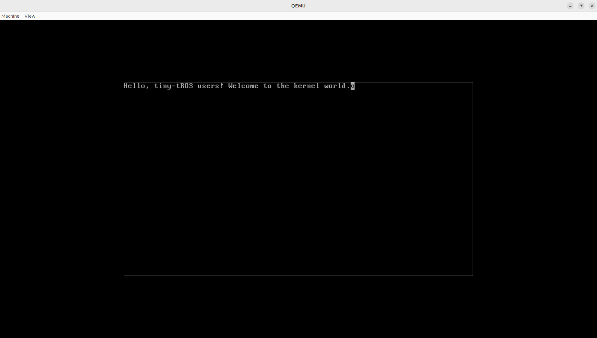
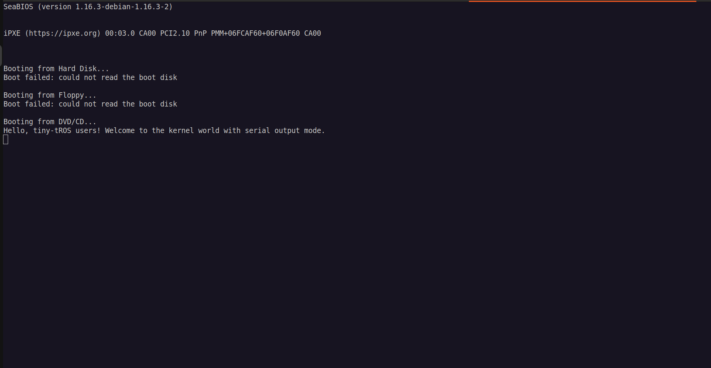

# tiny-tROS

Tiny kernel built for larger OS. This project I am doing for fun to learn how to build a kernel and OS.

## Structure

- boot: loading the kernel and jumping to it
- kernel: the kernel itself, which will be loaded by the bootloader
- lib: the library used by the kernel, which will be linked to the kernel
- drivers: the drivers used by the kernel, which will be linked to the kernel
- iso: the iso image used to boot the kernel, which will be created by the bootloader
- linker.ld: the linker script used to link the kernel

## Requirements

- [QEMU](https://www.qemu.org/) used as emulator to run the kernel: `sudo apt install qemu-system qemu-utils`
- [i686-elf-gcc](https://gcc.gnu.org/) used as cross compiler for kernel (install this is much harder than just sudo apt install, i already put the instruction in the [docs](./docs) folder, you can check it out if you have any question about the installing)
- [GNU Binutils](https://www.gnu.org/software/binutils/) used as assembler/linker for boot code and kernel linking: `sudo apt install binutils-multilib`
- [GRUB](https://www.gnu.org/software/grub/) used as bootloader: `sudo apt install grub-pc-bin xorriso`

## Documents

- If you have several struggle with the installing, development, and understanding of the code. I already put the entire "help" in the [docs](./docs) folder, you can check it out if you have any question about the project.
- Here is the overview output with 2 modes: screen and serial output mode

## References

- [Wiki OS Development](https://wiki.osdev.org/Main_Page)
- [The little book about OS development](https://littleosbook.github.io/)
